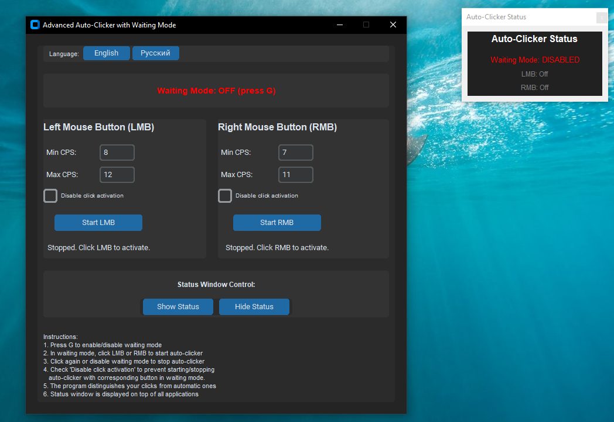
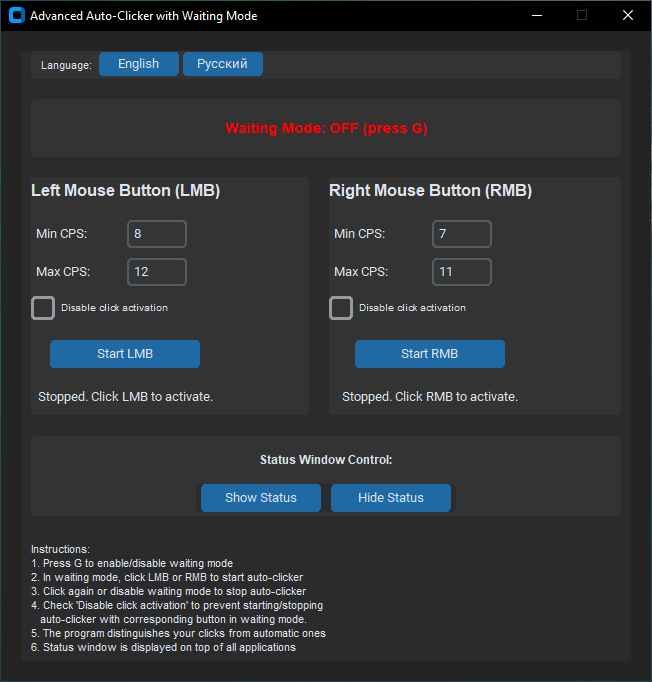
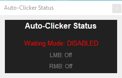
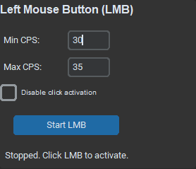
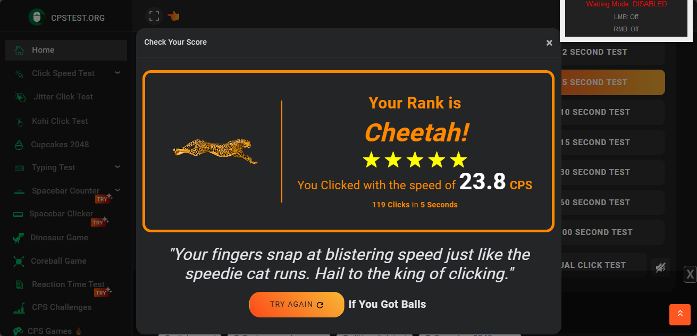

# KyeAutoclicker [Version: 1.0.0]

## ⚠️ IMPORTANT DISCLAIMER

**I AM NOT RESPONSIBLE FOR ANY DAMAGE TO YOUR COMPUTER IF YOU USE THIS PROGRAM INCORRECTLY.**  
**It is highly recommended to avoid setting a very high CPS (Clicks Per Second) for basic tasks.**

---

## 🎯 Introduction

Hello everyone! Have you been looking for an autoclicker that meets your needs? Whether you need it for gaming or everyday tasks, your search ends here. Meet **KyeAutoclicker** - a feature-rich autoclicker that gives you full control over CPS settings, customizable mouse buttons, and a real-time status monitor to prevent accidental system issues.

## 🖥️ What is KyeAutoclicker?

This autoclicker consists of two main windows:

- **Main Control Panel**: The large window where you configure CPS, enable/disable mouse buttons, change language, and toggle the status window

- **Status Window**: A small overlay that shows whether the autoclicker is currently active or not

## ⚙️ How It Works

The autoclicker operates on a simple principle:

1. Set CPS values for specific mouse buttons in the main window
2. Use checkboxes to disable activation for certain buttons
3. When a button is disabled, it won't respond to clicks even when the autoclicker is active
4. This prevents interference with other programs or gameplay

## 🎮 Practical Example

Here's how it works in practice:

1. **Set LMB (Left Mouse Button) values:**
   

2. **Test on cpstest.org with autoclicker enabled:**
   

## ❓ Frequently Asked Questions

### 🚀 What's the maximum CPS supported?
- I'm not exactly sure, but it can definitely handle over 30 CPS, possibly even 50 CPS.

### 💻 Which operating systems are supported?
- Currently supports **Windows 10** and **Windows 11**

### 🔍 Is the source code available?
- Yes! You can download the `.py` file and examine the source code.

### 🛡️ Is the program virus-free?
- I have no reason to harm you. The program is completely safe and virus-free (as long as you don't accidentally enable the autoclicker at the wrong time).

### 🔄 How do I turn off the autoclicker?
- Simply click the close button (X) on the main control panel - this will completely terminate the program.

### ⌨️ The "G" button doesn't work. What should I do?
- Close the program, switch your keyboard layout to English, and restart the application.

## ⚠️ Important Notes

**ATTENTION:**  
The program **CURRENTLY DOES NOT SUPPORT** MacOS or Linux, but support for these operating systems may be added in the future.

## 🔧 Current Limitations

- **No Bind Support**: Binding feature coming soon in the next update
- **Fixed Window Size**: Cannot resize windows - working on a solution
- **Limited Language Support**: Currently available only in **English** and **Russian**. If you're a native speaker of another language and want to help with translation, contact me: `223kamalrty@gmail.com`

## 📥 Download

### Option 1: Download from this repository
- Download the `.exe` file directly from this repository

### Option 2: Use the direct link
[https://mega.nz/file/ZJI1wIIQ#g-2q8fRpabSw5_JlZwk9_OOKb8m_zSqO3TipqmXDgpQ](https://mega.nz/file/ZJI1wIIQ#g-2q8fRpabSw5_JlZwk9_OOKb8m_zSqO3TipqmXDgpQ)

**✅ File verified (Verify File Integrity):**
**SHA256 Hash:** `988FBCD75E577AC8A8B4B21CCD21FDF1A72F16D806CC1B2F5405ECCA6F955874` V 1.0.0

---

**Happy clicking! 🎯**

